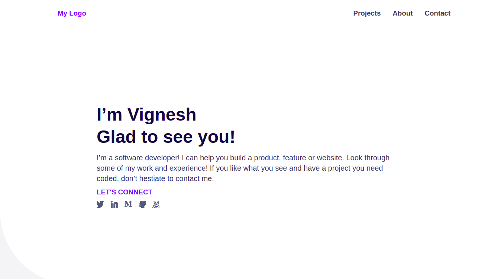

# Portfolio

> One paragraph statement about the project.

Additional description about the project and its features.

## Built With

- HTML
- CSS
- JS

## Live Demo

[Live Demo Link](https://vikipretium.github.io/portfolio_project/)

## Author

👤 **Vignesh**

- GitHub: [@vikipretium](https://github.com/vikipretium)
- Twitter: [@vikipretium](https://twitter.com/vikipretium)
- LinkedIn: [vikipretium](https://linkedin.com/in/vikipretium)

## 🤝 Contributing

👤 **Soufiane Boursen**

- GitHub: [@Sboursen](https://github.com/Sboursen)
- Twitter: [@sboursen_dev](https://twitter.com/sboursen_dev)
- LinkedIn: [LinkedIn](https://linkedin.com/in/sboursen)

👤 **Dagic Zewdu Tilahun**

- GitHub: [@Dagic-zewdu](https://github.com/Dagic-zewdu)
- Twitter: [@dagic4](https://twitter.com/dagic4)
- LinkedIn: [LinkedIn](https://www.linkedin.com/in/dagi-zewdu-21b835215/)

Contributions, issues, and feature requests are welcome!

Feel free to check the [issues page](../../issues/).

## Show your support

Give a ⭐️ if you like this project!

## Acknowledgments

- Hat tip to anyone whose code was used
- Inspiration
- etc

## 📝 License

This project is [MIT](./MIT.md) licensed.
